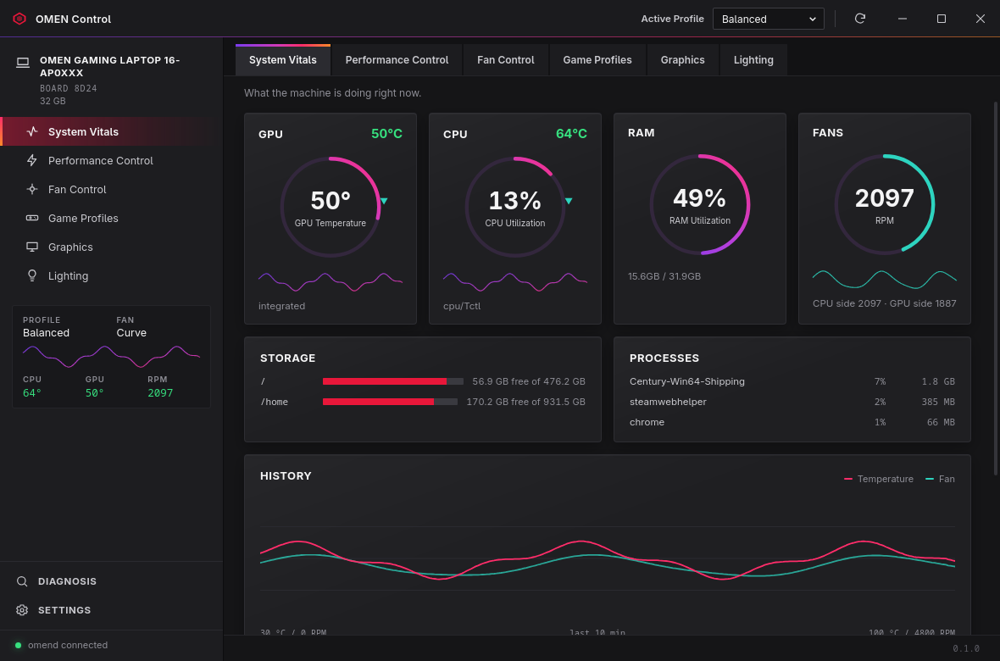
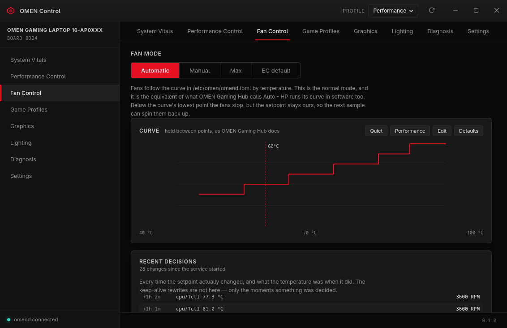
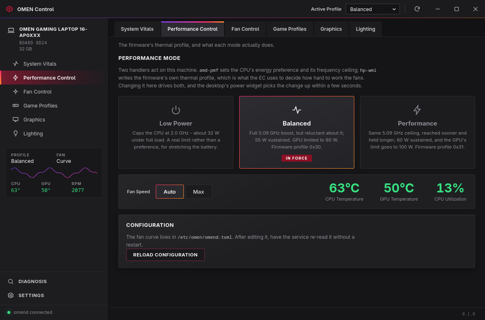
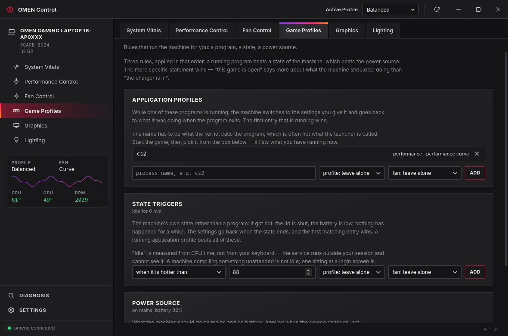
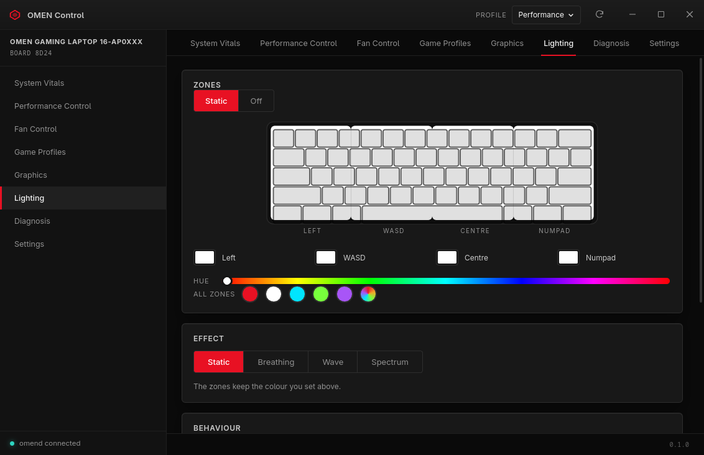
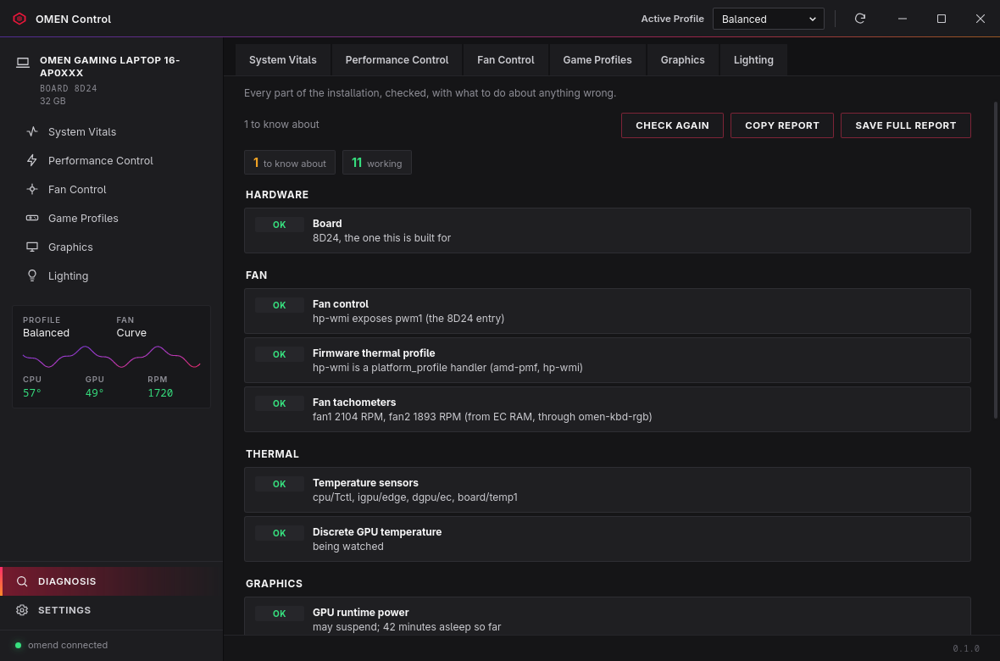
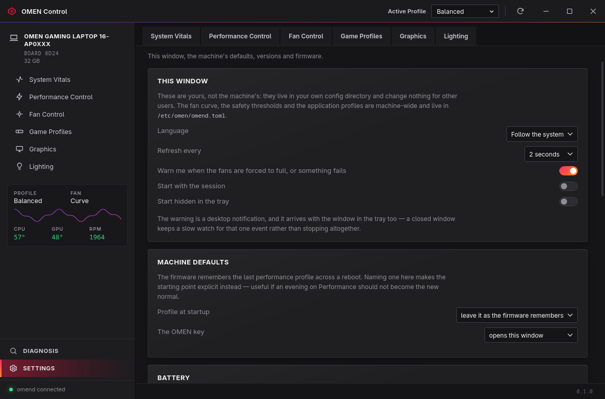
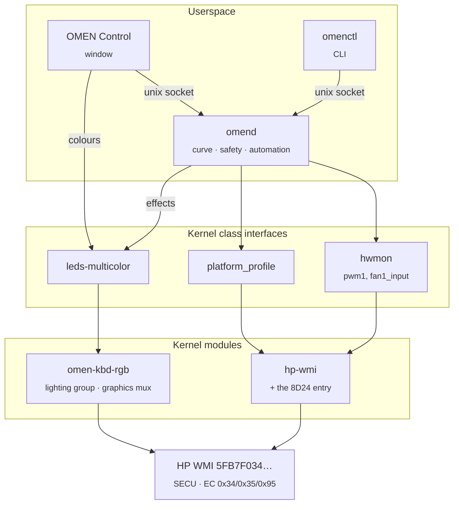
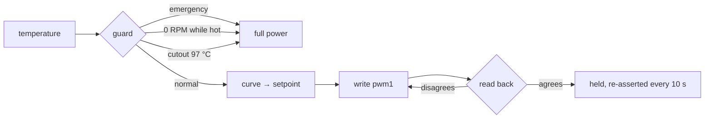

<div align="center">


# OMEN Control

**Fans, thermals, RGB and graphics switching for the HP OMEN 16-ap0xxx on Linux —
built by reading the firmware, not by guessing.**

[](#target-hardware)
[](#how-it-fits-together)
[](#layout)
[](LICENSE)



</div>

---

Everything here was measured on one machine and is written down with its
evidence. Where the hardware refused to do something, that is recorded too —
this project has been wrong in public twice, and both corrections are in the
git history.

## Install

```bash
git clone https://github.com/WinTone01/omen-linux-driver.git && cd omen-linux-driver && ./install.sh
```

It identifies the machine before touching anything, and stops if it is not an
HP OMEN or Victus. [What it installs, and the flags →](#what-installsh-does)

## The window

<table>
<tr>
<td width="50%"><br><b>Fan Control</b><br><sub>The curve, draggable, with presets and a log of every setpoint change.</sub></td>
<td width="50%"><br><b>Performance Control</b><br><sub>The firmware's thermal profile, and what each mode actually does.</sub></td>
</tr>
<tr>
<td><br><b>Graphics</b><br><sub>The mux, the discrete GPU's power state, and what is holding it awake.</sub></td>
<td><br><b>Game Profiles</b><br><sub>Per-application and per-power-source rules, restored on exit.</sub></td>
</tr>
<tr>
<td><br><b>Lighting</b><br><sub>Four zones, a hue strip, effects, and colours that survive a reboot.</sub></td>
<td><br><b>Diagnosis</b><br><sub>Named checks with remedies. Also <code>omenctl doctor</code>.</sub></td>
</tr>
<tr>
<td><br><b>Settings</b><br><sub>Window settings, machine defaults, version skew, firmware through fwupd.</sub></td>
<td valign="top"><br><b>And</b><br><sub>English and Turkish · a tray icon with profile and fan actions ·
one window however many times you click the icon · it reopens on the page you
left it on.</sub></td>
</tr>
</table>

## How it fits together

Three layers, each usable and upstreamable on its own. Nothing here invents a
sysfs tree of its own.



| Layer | Where | Why there |
|---|---|---|
| Fan + thermal profiles | upstream `hp-wmi` (8D24 patch) | in-tree, zero maintenance, standard `hwmon` |
| RGB keyboard + graphics mux | `omen-kbd-rgb` | coexists with `hp-wmi`, no blacklist needed |
| Curve, automation, CLI, window | userspace | standard sysfs, survives kernel upgrades |

Fans go through `hwmon`, profiles through `platform_profile`, RGB through
`leds-multicolor`. That way `sensors`, the desktop's power settings and
`upower` keep working without knowing this project exists — and our own tools
become the best option rather than the only one.

<details>
<summary><b>Why the fan is arbitrated in one place</b></summary>

<br>

A wrong colour is a wrong colour. A wrong fan setpoint can stop the fans while
thermal protection fails to step in — this board did exactly that — so every
write goes through `omend`, and clamping, the critical cutout and
restore-on-exit are guaranteed there and nowhere else.



</details>

## From the terminal

The window is optional. Everything it does has a command behind it.

```console
$ omenctl status
omend
  mode             curve
  driving sensor   cpu/Tctl 52.8 C
  target           1800 RPM
  uptime           788 s

$ omenctl doctor
HARDWARE
  OK   Board                      8D24, the one this is built for
FAN
  OK   Firmware thermal profile   hp-wmi is a platform_profile handler (amd-pmf, hp-wmi)
  OK   Fan tachometers            fan1 1700 RPM, fan2 1500 RPM
THERMAL
  OK   EC write access            ec_sys is loaded read-only, which is what this project expects
```

<details>
<summary><b>The rest of the commands</b></summary>

<br>

```bash
omenctl curve preset quiet     # quiet / default / performance
omenctl curve set 45:0,55:1800,75:2400,92:3600
omenctl set max                # or: curve / manual <RPM> / auto
omenctl clean 20               # fans at full power, to clear dust
omenctl app add cs2 performance curve:performance
omenctl power battery low-power curve:quiet
omenctl effect wave 7          # none / breathing / wave / spectrum
omenctl gpu                    # what is holding the discrete GPU awake
omenctl gpu mux discrete       # which GPU drives the screen, from the next boot
omenctl version                # what is running vs what is installed
omen-ui --tab graphics         # open the window on one page
```

</details>

## What install.sh does

Three pieces, in the order they depend on each other:

| | Gives you |
|---|---|
| `hp-wmi` with the 8D24 entry | `pwm1`, fan tachometers, `platform_profile` |
| `omen-kbd-rgb` | four RGB zones, `gpu_mux_mode` |
| `omen-control` | `omend`, `omenctl`, `omen-ui`, the unit and the udev rules |

Before any of that it identifies the board, because the EC registers and WMI
commands here were read out of one machine's firmware. `--check` does only
that part:

```console
$ ./install.sh --check          # nothing is installed, it just looks
[1/2] This machine
    vendor   HP
    model    OMEN Gaming Laptop 16-ap0xxx
    board    8D24
  ✓ OMEN 16-ap0xxx (8D24) — the board this was built and verified on
```

Another OMEN or Victus gets a warning and a prompt — the protocol is shared
across those models. Anything else is refused unless you pass `--force`.

`--no-gui` skips the window, `--yes` answers the prompts, `--uninstall` takes
it back out. On Arch it goes through `makepkg`, so pacman owns the files;
elsewhere it builds with `cargo` and DKMS directly. Over SSH, clone with
`git@github.com:WinTone01/omen-linux-driver.git` instead.

## What was found

| Phase | Scope | State |
|:--|:--|:--|
| **1** | Protocol extraction from the firmware | ✅ Done |
| **2** | `hp-wmi` 8D24 support | ✅ Verified on the machine |
| **3** | Daemon, RGB driver, GUI, automation | ✅ Working |

<details>
<summary><b>Phase 1 — the protocol was already supported</b></summary>

<br>

The fan and thermal protocol is *identical* to what upstream `hp-wmi` already
speaks. The only thing missing was this board's DMI entry.

| | |
|---|---|
| WMI group | `0x20008`, signature `"SECU"` |
| Fan | `0x2D` read · `0x2E` write (EC `0x34`/`0x35`) · `0x26`/`0x27` max |
| Profile | `0x1A` (EC `0x95`) — `0x30` balanced · `0x31` performance · `0x04` unleashed |
| Fan unit | hundreds of RPM, 18–48 → 1800–4800 RPM |

→ [`docs/research/phase1-findings.md`](docs/research/phase1-findings.md), with a
source for every claim.

</details>

<details>
<summary><b>Phase 2 — one line, and it worked</b></summary>

<br>

The prediction held: a one-line addition to the DMI table (`8D24` →
`omen_v1_legacy`) made `pwm1` appear, and EC `0x95` read back as **48** —
confirming the Windows measurement through a completely different path.

→ [`docs/research/phase2-plan.md`](docs/research/phase2-plan.md) ·
the patch is [checkpatch-clean](kernel/hp-wmi-8d24/patches/) and ready to send upstream.

</details>

<details>
<summary><b>Phase 3 — everything above the driver</b></summary>

<br>

The curve service, the RGB module, the window, the automation and the
diagnosis. → [`docs/usage.md`](docs/usage.md)

</details>

### Two corrections

They are the interesting part, so they are not buried.

> **“Hand the fans to the EC” is not a safe resting state on this board.**
> The critical cutout's only action used to be exactly that, and it did
> nothing while the CPU climbed to 98 °C. Every override forces full power
> now, and the bottom of the curve holds a setpoint of zero rather than
> letting go.

> **“This board has no mux.” It does.**
> The interface is numeric, so grepping the DSDT for `mux` found nothing, and
> in hybrid mode the runtime view is indistinguishable from a machine without
> one. The firmware declares it in its system design data: `GM28` computes
> byte 7 as `BIT(0)|BIT(1)|BIT(2)` — UMA, hybrid, discrete.

## Target hardware

| | |
|---|---|
| Model | HP OMEN Gaming Laptop 16-ap0xxx |
| Board | HP **8D24** rev 43.40 |
| BIOS | AMI F.11 (HPQOEM-1072009) |
| CPU | AMD Ryzen AI 9 365 (Strix Point) |
| dGPU | NVIDIA RTX 5060 Laptop |

> [!WARNING]
> The EC register map and command values here are **specific to this board.**
> Do not use them blindly on another OMEN — a wrong EC write can stop the fans
> entirely, and thermal protection does not always step in. Nothing in this
> project writes to the EC, for exactly that reason.

## Layout

```
install.sh          one command, with a hardware check in front of it
crates/             omen-core · omend (the daemon) · omenctl (the CLI)
ui/                 omen-ui — the window
kernel/
  hp-wmi-8d24/      the board entry: patch, build script, verify.sh
  omen-kbd-rgb/     4 RGB zones and the graphics mux
packaging/          systemd unit, udev rules, sysusers, PKGBUILD
docs/
  usage.md          configuration and the commands in full
  research/         how the protocol was read, with a source per claim
  acpi/             17 ACPI tables from the live system + the DSDT
  screenshots/
```

<details>
<summary><b>Reproducing the analysis</b></summary>

<br>

The ACPI tables were pulled from Windows with `GetSystemFirmwareTable` and
decompiled with `iasl` (not included; take it from an ACPICA release). The
profile byte values were captured from OMEN Gaming Hub's own log under
`%LOCALAPPDATA%\Packages\AD2F1837.OMENCommandCenter_*\`, whose lines print the
outgoing WMI input bytes directly.

</details>

<div align="center">
<br>
<sub>GPL-2.0-only — the same license as the kernel code this extends, because
the findings were produced to be submitted upstream.</sub>
</div>
