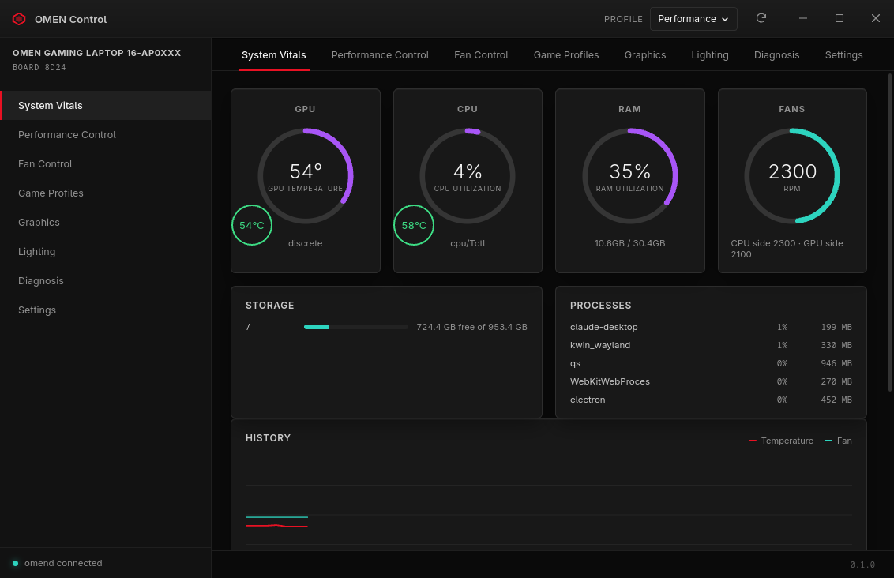
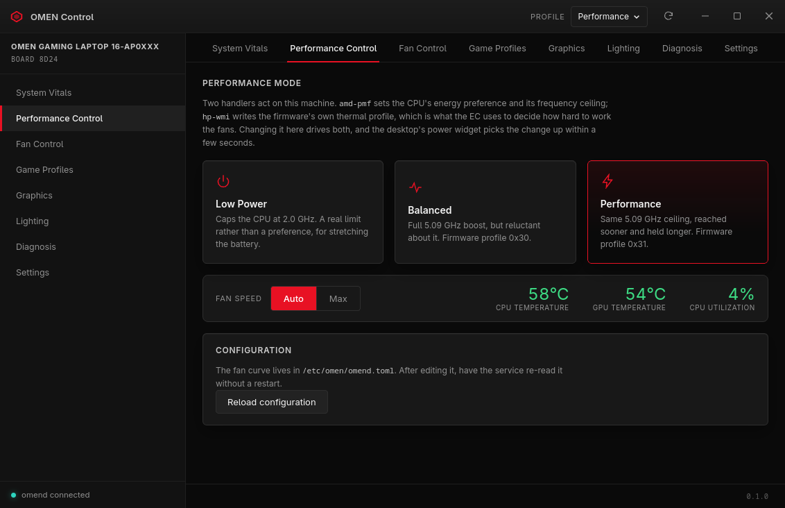
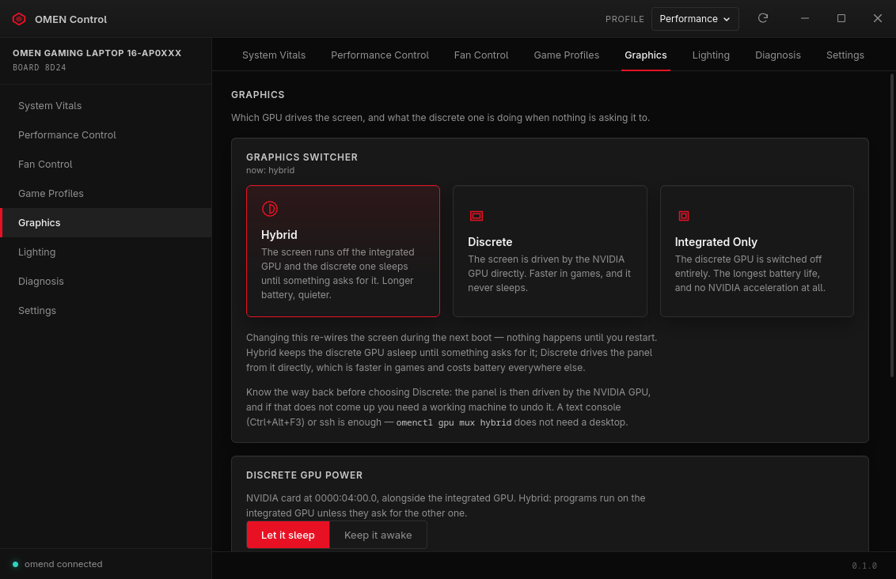
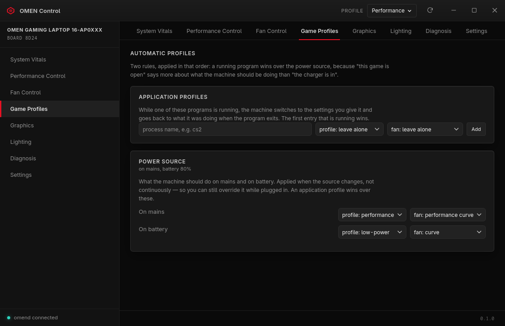
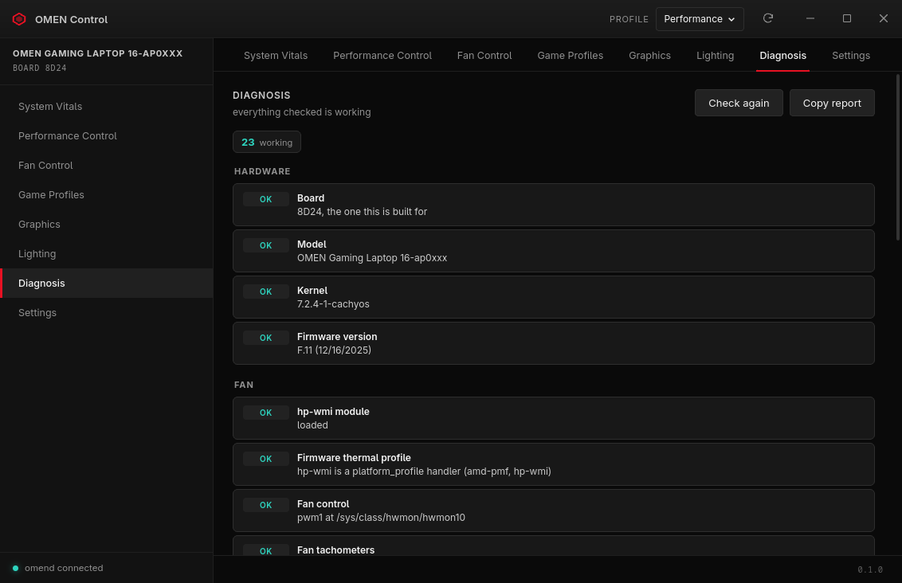
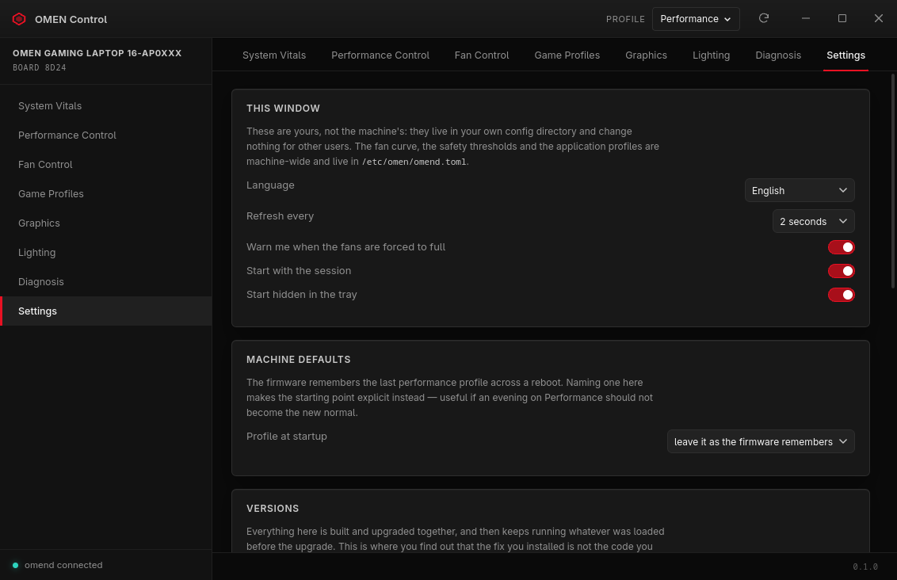

<div align="center">

# OMEN Control

**Fans, thermals, RGB and graphics switching for the HP OMEN 16-ap0xxx on Linux —
built by reading the firmware, not by guessing.**

[](#target-hardware)
[](#design-principle)
[](#layout)
[](LICENSE)



</div>

---

Everything here was measured on one machine and is written down with its
evidence. Where the hardware refused to do something, that is recorded too —
this project has been wrong in public twice, and both corrections are in the
git history.

## What it does

**Fans.** A curve service that reproduces OMEN Gaming Hub's own table, taken
from the `profiles.json` it ships. HP runs its curve in software; so do we.
The bottom of the curve stops the fans *while keeping the setpoint*, because
handing them back to the EC on this board means they stay stopped while the
machine heats up — measured, 78 → 85 °C in twelve seconds.

**Safety that was tested by failing.** A critical cutout, a behavioural stall
detector for fans reading 0 RPM while hot, a setpoint re-asserted every ten
seconds, and a read-back that notices when the hardware did not take it.

**RGB.** A 4-zone keyboard driver through `leds-multicolor`, with breathing,
wave and spectrum effects drawn by the daemon so they keep running when the
window is closed.

**Graphics.** This board has a mux — the firmware's own system design data
declares UMA, hybrid and discrete — so the panel can be switched between the
integrated and the discrete GPU. Plus the part that actually saves battery:
naming the programs keeping the discrete GPU awake, and the command that keeps
one off it.

**Automation.** Per-application profiles, mains/battery rules, a named curve
per rule, the OMEN key bound to the performance profile, and a resume hook.

**Diagnosis.** Every check named, with what to do about it — and a check that
could not run says so rather than reporting a fault.

## The window

<table>
<tr>
<td width="50%"><br><b>Fan Control</b><br><sub>The curve, draggable, with presets and a log of every setpoint change.</sub></td>
<td width="50%"><br><b>Performance Control</b><br><sub>The firmware's thermal profile, and what each mode actually does.</sub></td>
</tr>
<tr>
<td><br><b>Graphics</b><br><sub>The mux, the discrete GPU's power state, and what is holding it awake.</sub></td>
<td><br><b>Game Profiles</b><br><sub>Per-application and per-power-source rules, restored on exit.</sub></td>
</tr>
<tr>
<td><br><b>Lighting</b><br><sub>Four zones, a hue strip, effects, and colours that survive a reboot.</sub></td>
<td><br><b>Diagnosis</b><br><sub>Named checks with remedies. Also <code>omenctl doctor</code>.</sub></td>
</tr>
<tr>
<td><br><b>Settings</b><br><sub>Window settings, machine defaults, version skew, firmware through fwupd.</sub></td>
<td valign="top"><br><b>And</b><br><sub>English and Turkish · a tray icon with profile and fan actions ·
one window however many times you click the icon · it reopens on the page you
left it on.</sub></td>
</tr>
</table>

## Install

Two packages plus the kernel patch. The modules are separate because they are
DKMS packages with their own life cycle.

```bash
# The 8D24 entry for hp-wmi - without it there is no pwm1 and nothing works
bash phase2/scripts/build-module.sh --install

# The RGB + graphics-mux kernel module
cd phase3/kernel/omen-kbd-rgb && makepkg -sfi

# The daemon, the CLI and the window
cd phase3/packaging && makepkg -sfi

sudo systemctl enable --now omend
sudo usermod -aG omen $USER      # then log out and back in
```

Not on Arch? [`phase3/packaging/install.sh`](phase3/packaging/install.sh)
installs the same files by hand.

## From the terminal

```bash
omenctl status                 # what the machine is doing
omenctl doctor                 # check the whole installation, with remedies
omenctl curve preset quiet     # quiet / default / performance
omenctl curve set 45:0,55:1800,75:2400,92:3600
omenctl set max                # or: curve / manual <RPM> / auto
omenctl clean 20               # fans at full power, to clear dust
omenctl app add cs2 performance curve:performance
omenctl power battery low-power curve:quiet
omenctl effect wave 7          # none / breathing / wave / spectrum
omenctl gpu mux                # which GPU drives the screen
omenctl version                # what is running vs what is installed
```

## Design principle

We do not invent our own sysfs tree. Fans go through `hwmon`, profiles through
`platform_profile`, RGB through `leds-multicolor` — all existing kernel class
interfaces. That way `sensors`, desktop power settings and `upower` keep
working without knowing this project exists, and our own tools become the best
option rather than the only one.

Three layers, each usable and upstreamable on its own:

| Layer | Where | Why there |
|---|---|---|
| Fan + thermal profiles | upstream `hp-wmi` (8D24 patch) | in-tree, zero maintenance, standard `hwmon` |
| RGB keyboard + graphics mux | `omen-kbd-rgb` | coexists with `hp-wmi`, no blacklist needed |
| Curve, automation, CLI, window | userspace (`omend`, `omenctl`, `omen-ui`) | standard sysfs, survives kernel upgrades |

## What was found

| Phase | Scope | State |
|---|---|---|
| 1 | Protocol extraction from the firmware | **Done** |
| 2 | `hp-wmi` 8D24 support | **Done, verified on the machine** |
| 3 | Daemon, RGB driver, GUI, automation | **Working** |

**Phase 1** — the fan and thermal protocol is *identical* to what upstream
`hp-wmi` already supports; the only thing missing was the board's DMI entry.
WMI group `0x20008`, signature `"SECU"`, `0x2D`/`0x2E` read/write fan (EC
`0x34`/`0x35`), `0x1A` power profile (EC `0x95`). The fan unit is hundreds of
RPM, 18–48. → [`phase1/docs/phase1-findings.md`](phase1/docs/phase1-findings.md)

**Phase 2** — the prediction held: a one-line addition to the DMI table
(`8D24` → `omen_v1_legacy`) made `pwm1` appear, and EC `0x95` read back as 48,
confirming the Windows measurement through a completely different path.
→ [`phase2/docs/phase2-plan.md`](phase2/docs/phase2-plan.md)

**Phase 3** — everything above the driver.
→ [`phase3/README.md`](phase3/README.md)

Two corrections are worth reading, because they are the interesting part:

- *"Hand the fans to the EC"* is not a safe resting state on this board. The
  critical cutout's only action used to be exactly that, and it did nothing
  while the CPU climbed. Every override forces full power now.
- *"This board has no mux."* It does. The interface is numeric, so grepping
  the DSDT for "mux" found nothing, and in hybrid mode the runtime view is
  indistinguishable from a machine without one. The firmware declares it in
  its system design data: `GM28` computes byte 7 as `BIT(0)|BIT(1)|BIT(2)`.

## Target hardware

| | |
|---|---|
| Model | HP OMEN Gaming Laptop 16-ap0xxx |
| Board | HP **8D24** rev 43.40 |
| BIOS | AMI F.11 (HPQOEM-1072009) |
| CPU | AMD Ryzen AI 9 365 (Strix Point) |
| dGPU | NVIDIA RTX 5060 Laptop |

> The EC register map and command values here are **specific to this board.**
> Do not use them blindly on another OMEN — a wrong EC write can stop the fans
> entirely, and thermal protection does not always step in. Nothing in this
> project writes to the EC, for exactly that reason.

## Layout

```
phase1/   acpi/      17 ACPI tables from the live system + the decompiled DSDT
          extract/   EC field maps, the WMI dispatcher, GM/LM methods
          docs/      findings, with a source for every claim
phase2/   scripts/   verify.sh, add-8d24.sh, build-module.sh
          patches/   the 8D24 patch, checkpatch-clean
phase3/   crates/    omen-core, omend (daemon), omenctl (CLI)
          kernel/    omen-kbd-rgb - 4 RGB zones and the graphics mux
          ui/        omen-ui, the window
          packaging/ systemd unit, udev rules, PKGBUILD
```

## Reproducing the analysis

The ACPI tables were pulled from Windows with `GetSystemFirmwareTable` and
decompiled with `iasl` (not included; take it from an ACPICA release). The
profile byte values were captured from OMEN Gaming Hub's own log under
`%LOCALAPPDATA%\Packages\AD2F1837.OMENCommandCenter_*\`, whose lines print the
outgoing WMI input bytes directly.

## Credit

The protocol work stands on its own measurements, but two projects were read
along the way and saved real time: **OmenLinux/omen-rgb-keyboard** for the
lighting command group, and **omen-space** for the insight that the keyboard's
brightness field is an on/off switch rather than a level, and for the
system-design-data byte that settled the mux question.

Licensed GPL-2.0-only — the same license as the kernel code this extends,
because the findings were produced to be submitted upstream.
